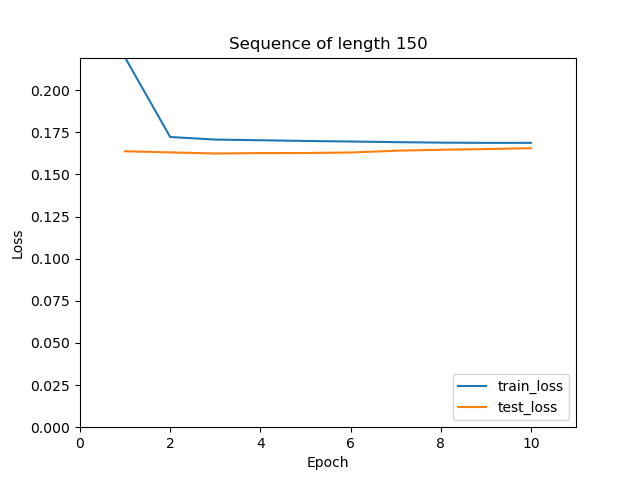
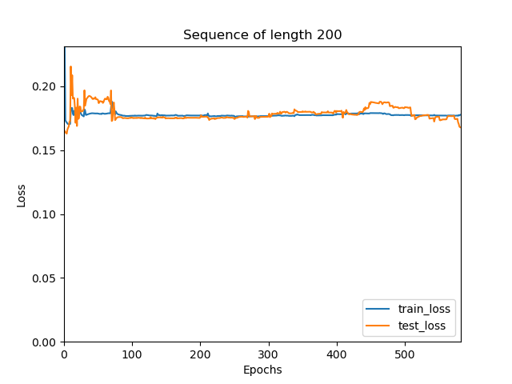
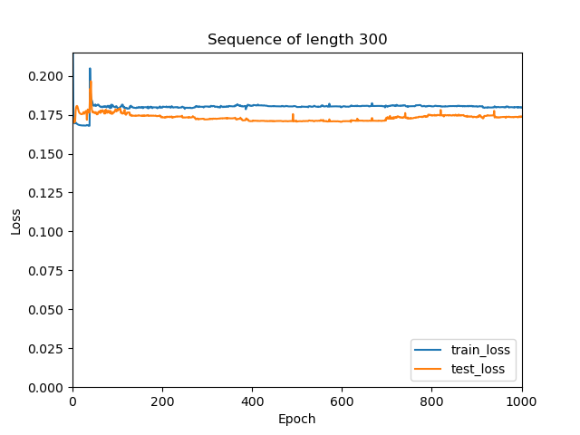
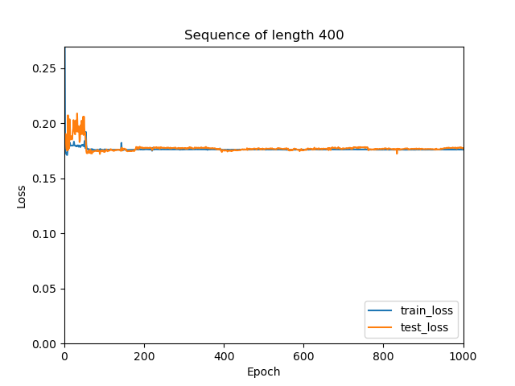

# Purpose
Evaluation that shows how the model performs depending on
training progress (epochs) as well as input sequence length. Demonstrate that the
model does not exhibit overfitting.

# Prerequisties
1. Install Python 3.7+. The code was tested in 3.7.
2. Ensure virtualenv is available or `pip install virtualenv`
3. `pip install --upgrade othoz-adding-sum`

# Tutorial files on running the RNN.
1. Sample code on how to run the tutorial is mentioned in `tutorial` folder
2. The training file(train_model.py) provides 3 output.
    * Tensorboard output log file. 
    Open the output in browser by going to `http://localhost:6006/`
    * Model output is saved in `/tmp/{sequence_length}`
    * Epoch logs as a csv file and tensorboard files `/tmp/loss_values_rnn_{sequence_length}.csv`
3. A sample script to run an executable is mentioned in `train_inference.sh`
4. You can view the output in tensorboard. Goto `http://0.0.0.0:6006/` in the browser.
5. Inference sample is provided in `inference.py`

# Commands to recreate the file
## Training the model:
Execute the below command in terminal to get the desired output
```
python tutorial/train_model.py --modelpath='/tmp/' --num_of_train_dataset=100 --num_of_test_dataset=100 \
--batch_size=100 --sequence_length=150 --rnn_nonlinearity='tanh' --clip_grad_norm=100 \
--log_write_folder='/tmp/' --learning_rate=0.01 --epochs=100 --shuffle=False --model_type="rnn"
```
## Running in Docker 
1. Execute the command in terminal to build the image: ```docker build --no-cache -t adding_sum -f Dockerfile .```
2. Run the docker image in a container:  ```docker run -v /tmp:/tmp -p 6006:6006  -it adding_sum```
3. The training and validation plot and model output could be found in ```/tmp/```
4. [Optional:Depends on the system] To see the tensorboard output. Goto ```http://127.0.0.1:6006/``` in the browser

## Inference of the model:
Execute the below command in terminal to run the inferred output
```
python tutorial/inference.py --model_filepath='/tmp/150.p'
```

## Train and inference of the model.
```
sh train_inference.sh
```

# Models:
The file supports two files RNN + TANH & RNN+ RELU. 
The desired parameters used in the model are mentioned in [arxiv_document](https://arxiv.org/abs/1504.00941).

## Evaluation 
In this step, the performance of the model is evaluated based on the training progress (epochs) as well as input sequence length.
### Overfitting
To ensure the model doesn't over fitting early stopping was used with desired threshold for the test data.

Overfitting check logic: 
1. Check if the test_loss is smaller than training loss. 
2. Ensure the test_loss is less than 0.17 or 17%
3. If the above condition are satisfied. A tolerance of 10 is added to ensure is valid.

### Experiment using RNN models with varied sequence length and fixed input:

**Note: In the example provided in the problem paper, the experiment was run with 100K train set and 10K test set. In this setup the ratio is maintained but the dataset is reduced due to hardware constraint the values.**

#### Setup:

<ins>Fixed input</ins>:
1. train_dataset: 10K 
2. test_dataset: 1K
3. rnn nonlinearity: tanh
4. gradient clipping: 100
5. learning_rate:0.01 
6. epochs:1000
7. batch_size: 100
9. Hidden size: 100
8. Model: RNN -> Linear

#### <ins>Simulation:</ins> 

* sequence_length 150<br>
 
* sequence_length 200

* sequence_length 300

* sequence_length 400


#### Optimum model with parameters

Sequence Length |Train Loss |Test Loss | Model found | Epochs
-------|-------|------|------|------
`150` | 0.168|0.165 |Yes | 9
`200` | 0.177|0.168 | Yes| 581
`300` |0.179|0.173 | No| 1000
`400` | 0.176|0.177 | No| 1000
The Loss function we have used is Mean square error,  where 0 means no loss best model and as the loss value increases the model is not optimum for the provided dataset.

<ins>Observations:</ins><br>
<br>
* From the above image and the tabular column it is evident that as the sequence length increases the test loss increases. So the model is not able to handle/remember longer sequences.
* Sequence length of 150 the optimum model found was in the 9th epoch and as the sequence length increases, the epoch value to increases. Example: Sequence length for 300  and 400 an optimum model was not found.
* In the sequence length 150 image we could see a convergence of the training loss and test loss in epoch 9.
* In the images for sequence length 200, 300,400. Initial we see an oscillation of the losses and as the epoch increases the training losses seems as stable line where as the test loss are oscillating. 
Increasing the learning rate could be an option. It is better to try other models . Example: LSTM.
* From the problem paper provided, the sequence length 150 converges slower than our experiment, so the data had an impact on the convergence. 

<ins>Next steps:</ins><br>
* Try out LSTM with forget bias


# Thank you for the opportunity!

